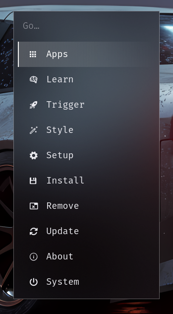

# Omarchy Velora

A dark, hard-edged **opaque frosted glass** theme for Omarchy 4 (Quattro).
Windows, the bar, menus, panels, notifications and the OSD all share one
backdrop: a strong Hyprland blur behind high-opacity, dark-tinted surfaces.

Requires Omarchy 4 / Quattro — the theme configures Hyprland through
`hyprland.lua` and Quickshell through `shell.toml`.

---

## Quick Install

```bash
omarchy theme install https://github.com/shoxjaxon-atabayev/omarchy-velora-theme
```

## Screenshots


## LockScreen


## Launcher


