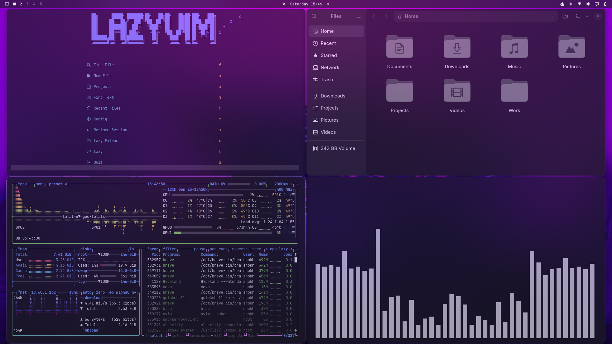
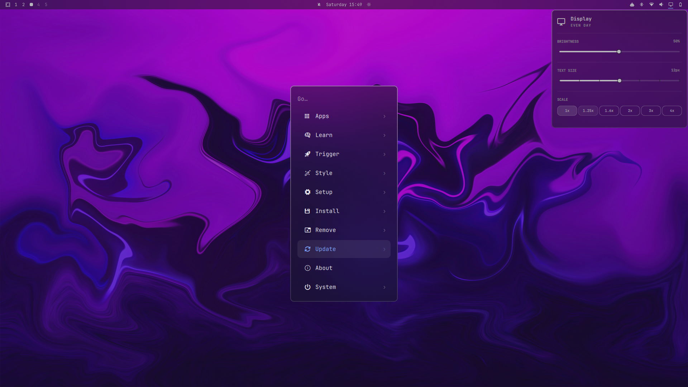
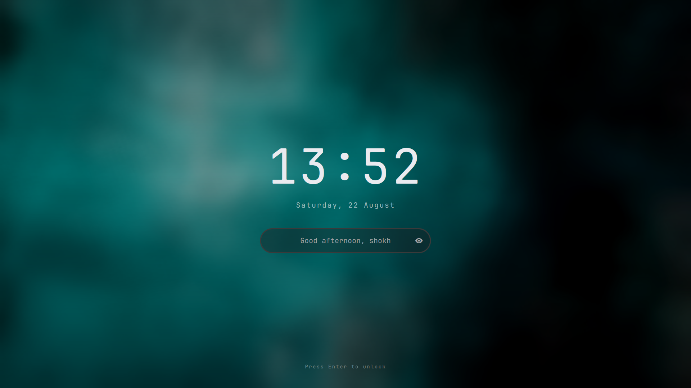

# Omarchy Velora

**Velora** is a dark **frosted glass theme for Omarchy 4 / Quattro**, designed
around strong background blur, translucent dark surfaces, and a refined
glassmorphism desktop aesthetic.

Velora brings a consistent frosted-glass treatment to **Hyprland windows,
Quickshell surfaces, the Omarchy bar, menus, notifications, OSD, launcher,
lock screen, and terminal**.

> Built for Omarchy 4 / Quattro.

---

## Preview



---

## Features

- Premium frosted-glass aesthetic
- Strong wallpaper-aware background blur
- Dark translucent window surfaces
- Consistent glass treatment across Omarchy UI
- Hyprland blur and window transparency
- Quickshell / Quattro surfaces
- Frosted menus and launcher
- Glass-style notifications and OSD
- Dark frosted lock screen
- Alacritty terminal theming
- Developer-focused dark color palette
- High-contrast typography and subtle accents

---

## Screenshots

### Desktop


### Frosted Glass UI



### Lock Screen



> **Note:** this design is not part of Velora and isn't produced by anything
> in this repo. Omarchy's stock lock screen is a single fixed layout that
> Velora can only tint via `shell.toml`'s `[lock]` colors — Hyprland's native
> blur can't reach it either, since the lock screen renders as its own
> `ext-session-lock` surface with a hardcoded Quickshell blur, not a
> layer-shell surface Velora's `hyprland.lua` rules can target. The screen
> above comes from a separate, third-party Quickshell plugin, **[Lock Screen
> Explorer](https://github.com/SirJul1337/omarchy-lock-explorer)** by
> SirJul1337, which swaps out Omarchy's stock lock service for a picker with
> multiple layouts (colors and fonts still come from your Omarchy theme, so
> it matches Velora automatically). To get the same result:
>
> ```sh
> # 1. Install and enable the plugin
> omarchy plugin add https://github.com/SirJul1337/omarchy-lock-explorer.git --enable
>
> # 2. Restart the shell so it takes over the `lock` IPC target from the stock service
> omarchy restart shell
>
> # 3. Open the picker (browse designs, Enter to select, Esc to close)
> omarchy-shell lock explore
> ```
>
> See that plugin's own README for the full command list (`setDesign`,
> `previewDesign`, avatar/unlock-animation options, etc.) and its
> troubleshooting section if `lock explore` still answers with the stock
> screen after restarting. To go back to Omarchy's stock lock screen:
> `omarchy plugin remove io.github.sirjul1337.lock-explorer && omarchy restart shell`.

---

## Installation

Install Velora directly with Omarchy:

```bash
omarchy theme install https://github.com/shoxjaxon-atabayev/omarchy-velora-theme
```

After installation, select **Velora** from the Omarchy theme selector.

---

## Design

Velora is built around a dark frosted-glass visual language.

The theme combines:

- Dark tinted surfaces
- Strong background blur
- Controlled transparency
- Subtle borders
- Muted blue and red accents
- Consistent contrast across desktop surfaces

The goal is to make wallpaper and background content remain visible
through the glass while keeping applications and UI elements readable.

---

## Components

Velora currently provides styling for:

- Hyprland
- Quickshell / Omarchy 4
- Omarchy Bar
- Launcher
- Menus
- Notifications
- OSD
- Polkit
- Lock Screen
- Alacritty

---

## Requirements

- Omarchy 4 / Quattro
- Hyprland
- Quickshell

---

## Repository

**Velora — Frosted Glass Theme for Omarchy**

If you like the theme, consider giving the repository a ⭐ on GitHub.
